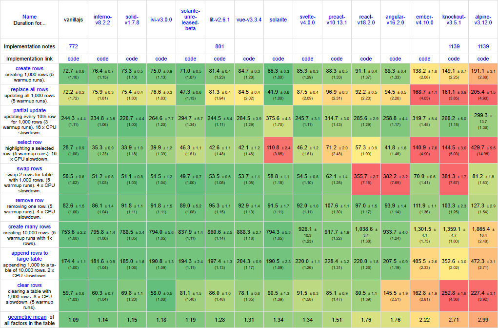

<!-- To convert documentation to html: (1) Open in Typora.  (2) Select the GitHub theme, or go to Settings -> Export -> Html -> Theme -> Github. (3) Then go to File -> Export -> Export as html with styles to index.html. -->

<!-- Playgrounds that don't have a lowercase language name will not have a preview. -->

# Solarite

Solarite is a small (8KB min+gzip), fast, compilation-free JavaScript library (not [framework](https://www.youtube.com/watch?v=evmZTh7l6UE)) for rendering minimal updates to elements and web components.  Features:

- No magic:  Renderer only when you want via the manually invoked `render()` method.
- No setting up state variables.  Render any regular variable or data structure.
- Local scoped styles:  Inherit external styles but define new styles that apply only to the web component and its children.
- Elements with `id` or `data-id` attributes become class properties.
- Attributes are passed as constructor arguments to nested components.
- Single file.  No build steps and no dependencies.  Not even Node.js.  Just `import` Solarite.js or Solarite.min.js into your vanilla JavaScript and start coding.
- MIT license.  Free for commercial use.  No attribution needed.

```javascript
import {h} from './dist/Solarite.min.js';

class ShoppingList extends HTMLElement {
	constructor(items=[]) {
		super();
		this.items = items;
		this.render();
	}

	addItem() {
		this.items.push({name: '', qty: 0});
		this.render();
	}

	removeItem(item) {
		this.items.splice(this.items.indexOf(item), 1);
		this.render();
	}

	render() { 
		// Think of h(this) as like:
		// this.outerHTML = `<shopping-list>...` 
		// but rendering only minimal DOM updates when the html changes.
		h(this)`
        <shopping-list>
            <style> /* scoped styles */
                :host input { width: 80px }
            </style>

            <button onclick=${this.addItem}>Add Item</button>

            ${this.items.map(item => h`
                <div>  <!-- 2-way binding -->
                    <input placeholder="Item"value=${[item, 'name']}
                        oninput=${this.render}>
                    <input type="number" value=${[item, 'qty']}
                        oninput=${this.render}>
                    <button onclick=${()=>this.removeItem(item)}>x</button>
                </div>			 
            `)}

            <pre>items = ${JSON.stringify(this.items, null, 4)}</pre>
        </shopping-list>`
	}
}

customElements.define('shopping-list', ShoppingList);
document.body.append(new ShoppingList()); // add <shopping-list> element
```

## Installation

To use, import one of these pre-bundled es6 modules into your project:

- [Solarite.js](https://cdn.jsdelivr.net/gh/Vorticode/Solarite/dist/Solarite.min.js) - 85KB
- [Solarite.min.js](https://cdn.jsdelivr.net/gh/Vorticode/Solarite/dist/Solarite.min.js) - 24KB / 8KB gzipped

Or get Solarite from GitHub or NPM:

- [Solarite GitHub Repository](https://github.com/Vorticode/solarite)  <a class="github-button" href="https://github.com/vorticode/solarite" data-color-scheme="no-preference: light; light: light; dark: dark;" data-icon="octicon-star" data-size="small" data-show-count="true" aria-label="Star vorticode/solarite on GitHub">Star</a>
- `git clone https://github.com/Vorticode/solarite.git`
- `npm install solarite`

This project is currently in BETA stage.  Tip:  A JetBrains IDE like [WebStorm](https://www.jetbrains.com/webstorm/), [PhpStorm](https://www.jetbrains.com/phpstorm/), or [IDEA](https://www.jetbrains.com/idea/) will syntax highlight the html template strings.

## Performance

Here is Solarite on Stefan Krause's famous js-framework-benchmark versus some other common libraries.  Run on a Ryzen 7 3700X on Windows 10.  Performance is still improving with each version.

## Concepts

### Regular Elements

The `h()` function can create html elements.  Pass any object with a `render()` function as the first argument.  This object can optionally have additional properties and methods, which become bound to the resulting element.  When `render()` is called, only the changed nodes will be updated.

```javascript
import {h} from './dist/Solarite.min.js';

let button = h({
    count: 0,

    inc() {
        this.count++;
        this.render();
    },

    render() {
        h(this)`<button onclick=${this.inc}>I've been clicked ${this.count} times.</button>`
    }
});
document.body.append(button);
```

If you want multiple instances of such an element, the code above can be wrapped in a function:

```javascript
import {r} from './dist/Solarite.min.js';

function createButton(text) {
	return r({
		count: 0,

		inc() {
			this.count++;
			this.render();
		},

		render() {
			h(this)`<button onclick=${this.inc}>${this.count} ${text}</button>`
		}
	})
}
document.body.append(createButton('clicks'));
document.body.append(createButton('tickles'));
```

### Web Components

Solarite can also create [web components](https://developer.mozilla.org/en-US/docs/Web/API/Web_components).  In this minimal example, we make a new class called `MyComponent` which extends from `HTMLElement` like any other web component.  We provide a `render()` function to set its html, and a constructor to call it when a new instance is created.

All browsers require web component tag names to have at least one dash in the middle.  

```javascript
import {h} from './dist/Solarite.min.js';

class MyComponent extends HTMLElement {
	name = 'Solarite';
    
    constructor() {
        super(); // JavaScript requires a super() call for sub-class construtors.
        this.render();
    }
    
	render() {
        // This is how we'd create a web component using vanilla JavaScript
        // without Solarite.  But this recreates all children on every render!
        //this.innerHTML = `Hello <b>${this.name}!<b>`;
        
        // Using Solarite's h() function performs minimal updates on render.
		h(this)`<my-component>Hello <b>${this.name}!</b></my-component>`
	}
}

// Register the <my-component> tag name with the browser.
// Browsers require this for all web components.
customElements.define('my-component', MyComponent);

document.body.append(new MyComponent());
```

Alternatively, instead of instantiating the element in JavaScript, we could can instantiate the element directly from html:

```Html
<my-component></my-component>
```

JavaScript veterans will realize that other than the `h()` function, this is highly similar to one might create vanilla JavaScript web components.  This is by design!

Since these are just regular web components, they can define the [connectedCallback()](https://developer.salesforce.com/docs/platform/lwc/guide/create-lifecycle-hooks-dom.html#connectedcallback) and [disconnectedCallback()](https://developer.salesforce.com/docs/platform/lwc/guide/create-lifecycle-hooks-dom.html#disconnectedcallback) methods that will be called when they're added and removed from the DOM, respectively.  These functions are only supported for web components and not regular elements.

### Rendering

The `h` function, when used as a [tagged template literal](https://developer.mozilla.org/en-US/docs/Web/JavaScript/Reference/Template_literals#tagged_templates) , converts the html and embedded expressions into a Solarite `Template`.  This is a data structure used by Solarite to store processed html and expressions.  The call to `h(this)` then renders that `Template` as an element's attributes and children.  You can think of this like assigning to the browser's built-in `this.outerHTML` property, except updates are much faster because only the changed elements are replaced, instead of all nodes.

Unlike other frameworks, Solarite does not re-render automatically when data changes, so you should call the `render()` function manually.  This is a deliberate design choice to reduce unexpected side effects, since in some cases you may want to update internal data without rendering.

Wrapping the web component's html in its tag name is optional.  But without it you then must set any attributes on your web component manually, as seen in this example:

```javascript
import {h} from './dist/Solarite.min.js';

class MyComponent extends HTMLElement {
	name = 'Solarite';
	render() { 
		// With optional element tags:
		// h(this)`<my-component class="big">Hello <b>${this.name}!<b></my-component>`
		
		// Without optional element tags:
		h(this)`Hello <b>${this.name}!<b>`;
        this.setAttribute('class', 'big');
	}
}
customElements.define('my-component', MyComponent);
document.body.append(new MyComponent());
```

If you do wrap the web component's html in its tag, that tag name must exactly match the tag name passed to `customElements.define()`.

Note that by default, `h()` will render expressions as text, with escaped html entities.  To render as html, wrap a variable in the `h()` function:

```javascript
import {h} from './dist/Solarite.min.js';

let folderIcon = `
<svg width="10em" height="10em" viewBox="0 0 24 24">
	<path fill="currentColor" d="M2 4h8l2 2h10v14H2V4Zm2 2v12h16V8h-8.825l-2-2H4Zm0 12V6v12Z"/>
</svg>`;


let icon1 = h({
	render() {
		h(this)`<div>${folderIcon}</div>`
	}
});
document.body.append(icon1);


let icon2 = h({
	render() { // string wrapped in h()
		h(this)`<div>${h(folderIcon)}</div>`
	}
});
document.body.append(icon2);

```

Folder icon comes from [Google](https://icon-sets.iconify.design/material-symbols/folder-outline/).

These types of objects can be returned by in expressions with `h` tagged template literals:

1. strings and numbers.
2. boolean true, which will be rendered as 'true'
3. false, null, and undefined, which will be rendered as empty string.
4. Solarite Templates created by `h`-tagged template literals.
5. DOM Nodes, including other web components.
6. Arrays of any of the above.
7. Functions that return any of the above.

### Attributes

Dynamic attributes can be specified by inserting expressions inside a tag.  An expression can be part or all of an attribute value, or a string specifying multiple whole attributes.  For example:

```javascript
himport {r} from './dist/Solarite.min.js';

let style = 'width: 100px; height: 40px; background: orange';
let isEditable = true;
let height = 40;

let attributeDemo = h({
	render() { 
		h(this)`
        <div class="big">
            <div style=${style}>Look at me</div>
            <div style="${'width: 100px'}; height: ${height}px; background: gray">Look at me</div>
            <div style="width: 100px; height: 40px; background: brown" ${'title="I have a title"'}>Hover me</div>
            <div style="width: 100px; height: 40px; background: red" contenteditable=${isEditable} >Edit me</div>
        </div>`
	}
});

document.body.append(attributeDemo);

style = 'width: 100px; height: 40px; background: green';
setTimeout(attributeDemo.render, 2000);
```

Expressions can also toggle the presence of an attribute.  In the last div above, if `isEditable` is false, null, or undefined, the contenteditable attribute will be removed.

Note that attributes can also be assigned to the root element, such as `class="big"` on the `<attribute-demo>` tag above.

### Id's

Any element in the html with an `id` or `data-id` attribute is automatically bound to a property with the same name on the class instance.  But this only happens after `render()` is first called:

```javascript
import {h} from './dist/Solarite.min.js';

let raceTeam = h({    
	render() { 
        h(this)`
		<div>
            <input id="driver" value="Mario">
            <div data-id="car">Cutlas Supreme</div>
            <div data-id="instructor.name">Lightning McQueen</div>
        </div>`
	}
});
document.body.append(raceTeam);

raceTeam.driver.value = 'Luigi'; 
raceTeam.car.style.border = '1px solid green';
// We don't need to call render() because we're editing the DOM Directly.
```

Id's that have values matching built-in HTMLElement attribute names such as `title` or `disabled` are not allowed.

### Events

To intercept events, set the value of an event attribute like `onclick` to a function.  Alternatively, set the value to an array where the first item is a function and subsequent items are arguments to that function.

```javascript
import {h} from './dist/Solarite.min.js';

class EventDemo extends HTMLElement {
	constructor() {
		super();
		this.render();
	}
	
	showMessage(message) {
		alert(message);
	}
	
	render() { 
		h(this)`
		<event-demo>
			<button onclick=${(ev, el)=>alert('Element ' + el.tagName + ' clicked!')}>Click me</button>
			<button onclick=${[this.showMessage, 'I too was clicked!']}>Click me too!</button>
		</event-demo>`
	}
} 
customElements.define('event-demo', EventDemo);
document.body.append(new EventDemo());
```

Event binding with an array containing a function and its arguments is slightly faster, since the function isn't recreated when `render()` is called, and it doesn't need to be unbound and rebound.  But the performance difference is usually negligible.

Make sure to put your events inside `${...}` expressions, because classic events can't reference variables in the current scope.

### Two-Way Binding

Form elements can update the properties that provide their values if an event attribute such as `oninput` is assigned a function to perform the update:

```javascript
import {h} from './dist/Solarite.min.js';

class BindingDemo extends HTMLElement {
   
	constructor() {
        super();
        this.count = 0;
        this.lines = [];
        this.render();
    }
    
	render() { 
		h(this)`
        <binding-demo>
            <input type="number" value=${this.count} 
                oninput=${ev => {
                    this.count = ev.target.value;
                    this.render();
                }}>
            <pre>count is ${this.count}</pre>
            <textarea rows="6" value=${this.lines.join('\n')}
            	oninput=${ev => {
        			this.lines = ev.target.value.split('\n')
                    this.render();
        		}}            
            ></textarea>            
            <pre>line count is ${this.lines.length}</pre>
            <button onclick=${()=> { 
                this.count = 0;
            	this.lines = [];
                this.render();
            }}>Reset</button>
        </binding-demo>`
	}
}
customElements.define('binding-demo', BindingDemo);

document.body.append(new BindingDemo());
```

In addition to `<input>`,  `<select>` and `<textarea>` can also use the `value` attribute to set their value on render.  Likewise so can any custom web component that defines a `value` property.

A shorthand way to do two-way binding is to pass a property path as an expression to a property's attribute.  Here with `value=${[this, 'count']}`.  When a user types in the input, Solarite listens to the `oninput` listener and updates `this.count`.  Note that we still need a second `oninput` attribute if we want to trigger rendering.

```javascript
import {h} from './dist/Solarite.min.js';

class BindingDemo extends HTMLElement {
   
	constructor() {
        super();
        this.reset();
    }
    
    reset() {        
        this.count = 0;
        this.isBig = false;
        this.render();
    }
    
	render() { 
		h(this)`
        <binding-demo>
        	<style> :host { font-size: ${this.isBig ? 20 : 12}px }</style>
            <input type="number" value=${[this, 'count']}
                oninput=${this.render}><br>
            <label>
                <input type="checkbox" checked=${[this, 'isBig']}
                    oninput=${this.render}> Big Text
            </label>
            <pre>count is ${this.count}</pre>
            <button onclick=${this.reset}>Reset</button>
        </binding-demo>`
	}
}
customElements.define('binding-demo', BindingDemo);

document.body.append(new BindingDemo());
```


### Loops

As previously seen, loops can be written with JavaScript's [Array.map()](https://developer.mozilla.org/en-US/docs/Web/JavaScript/Reference/Global_Objects/Array/map) function:

```javascript
import {h} from './dist/Solarite.min.js';

class TodoList extends HTMLElement {
	render() { 
		h(this)`
        <todo-list>
            ${this.items.map(item => 
                h`${item}<br>`
            )}
        </todo-list>`
	}
}
customElements.define('todo-list', TodoList);

let list = new TodoList();
list.items = ['one', 'two', 'three'];
list.render();
document.body.append(list);

list.items[1] = '2';
list.render();

list.items.splice(1, 0, 'two and a half');
list.render();
```

When we change an element or add another element to the `items` list, calling `render()` only redraws the changed or new element.  The other list items are not modified.

Note that nested template literals must also have the `h` prefix. Otherwise they'll be rendered as escaped text instead of HTML elements.

### Scoped Styles

Html with `style` elements will be rewritten so that the `:host` selector applies to the root element.  This allows an element to specify styles that will apply only to itself and its children, while still inheriting styles from the rest of the document.

These local, "scoped" styles are implemented by:

1. Adding a `data-style` attribute to the root element with a unique, incrementing id value for each instance.
2. Replacing any `:host` selectors inside the style with `element-name[data-style="1"]`.  For example the `:host` selector below becomes `fancy-text[data-style="1"]`.

```javascript
import {h} from './dist/Solarite.min.js';

class FancyText extends HTMLElement {
	render() { 
        h(this)`
        <fancy-text>
            <style>
                :host { display: block; border: 10px dashed red } 
                :host p { text-shadow: 0 0 3px #f40 } 
            </style>
            <p>I have a red border and shadow!</p>
        </fancy-text>`
        
        /* The code above is rewritten as:
        <fancy-text data-style="1">
            <style>
                fancy-text[data-style="1"] { display: block; border: 10px dashed red } 
                fancy-text[data-style="1"] p { text-shadow: 0 0 3px #f40 } 
            </style>
            <p>I have a red border and shadow!</p>
        </fancy-text>`
        */
	}
}
customElements.define('fancy-text', FancyText);
let el = new FancyText();
el.render();
document.body.append(el);
```

Note that if shadow-dom is used, the element will not replace the `:host` selector in styles, as  browsers natively support the `:host` selector when inside shadow DOM.

### Child Components

When one web component is embedded within another, its attributes and children are passed as arguments to the constructor:

```javascript
import {h} from './dist/Solarite.min.js';

class NotesItem extends HTMLElement {
	// Constructor receives item object from attributes.
	constructor({item, fontSize}, children) {
		super();
		this.item = item;
        this.fontSize = fontSize;
		this.render();
	}
	
	render({item, fontSize}={}) {
        // If item passed to the constructor has changed.
        if (item) this.item = item;
        if (fontSize) this.fontSize = fontSize;
		h(this)`
		<notes-item>
		   <style> :host { font-size: ${this.fontSize}px }</style>
		   <b>${this.item.name}</b> - ${this.item.description}<br>
		</notes-item>`
	}
}
customElements.define('notes-item', NotesItem);

class NotesList extends HTMLElement {
	render() { 
		h(this)`
		<notes-list>
			${this.items.map((item, i) => // Pass item object to NotesItem constructor:
				h`<notes-item item=${item} font-size=${15+i}</notes-item>`
			)}
		</notes-list>`
	}
}
customElements.define('notes-list', NotesList);

let list = new NotesList();
list.items = [
	{
		name: 'English',
		description: 'See spot run.'
	},
	
	{
		name: 'Science',
		description: 'Snails are mollusks.'
	}
]
list.render();
document.body.append(list);

list.items[0].name = 'PhysEd';

// list.items[0] has changed, 
// so this will call render() on the first NotesItem, 
// passing the new item object to its render() function.
list.render();

```

Since html attributes are case-insensitive, Solarite converts dash-case (aka kabob-case) attribute names to camelCase, as happens above with the `font-size` attribute becoming the `fontSize` argument.

Calling `render()` on a parent component will call `render()` on child components if the attributes passed to the child component have changed.  The new attributes will be passed as an object as the first argument to the child component's `render()` function.  The `render()` function can then decide what to do with that data, and if it should re-render itself by calling `h(this)`, which will in turn call `render()` on its own child web components.

In the above code, we alternatively could've created the `<notes-item>` element via the `new` keyword, but doing so would cause all `NotesItem` components to be recreated on every render.

```JavaScript
class NotesList extends HTMLElement {
	render() { 
		h(this)`
		<notes-list>
			${this.items.map(item => // Pass item object to NotesItem constructor:
				new NotesItem({item: item})
			)}
		</notes-list>`
	}
}
```


### The h() function

The `h()` function renders templates and html elements.  There are multiple ways to use the `h()` function:

```JavaScript
import {h} from './dist/Solarite.min.js';

// h`string`
// Convert the html to a Template that can later be used to create nodes.
let template = h`Hello ${"World"}!`;

// h(HTMLElement, Template)
// Render the template created by #1 to the <body> tag.
h(document.body, template);  

// h(Template):Node|HTMLElement
// Render Template created by #1 creating a standaline HTML Element
let el = h(template);

// h(HTMLElement)`string`
// Create template and render its nodes to el.
h(el)`<b>${'Hi'}</b>`;

// h(html:string):TextNode
// Create single text node.
let textNode = h('Hello');           

// h(html:string):HTMLElement
// Create single HTMLElement.
let el2 = h('<b>Hello</b>');

// h(html:string):DocumentFragment
// Create document fragment because there's more than one node.
let fragment = h('Hello <u>Goodbye</u>');

// h(function():Template, Object<string, function|*>):HTMLElement
// Crete a button element, with the fist function being the render function.
let button = h({
    render() {
        h(this)`<button>Submit</button>`
    }
});
document.body.append(button);

```

### Extending Other DOM Elements.

Suppose you want to use a custom component for each `<tr>` in a `<table>`.  Html won't allow you to put just any element as a child of table or tbody.  In this case you can make your web component inherit from the browser's built in `<tr>` element, by passing it as the third argument to `customElements.define`:

```javascript
import {h} from './dist/Solarite.min.js';

class LineItem extends HTMLElement {
	constructor(user) {
		super();
		this.user = user;
        this.render();
	}
						   
	render() { 
		h(this)`			   
            <th>${this.user.name}</td>
            <td>${this.user.email}</td>`
	}
}

customElements.define('line-item', LineItem, HTMLTableRowElement);

let table = document.createElement('table')
for (let i=0; i<10; i++) {
	let user = {name: 'User ' + i, email: 'user'+i+'@example.com'};
	table.append(new LineItem(user));
}
document.body.append(table);
```

### Manual DOM Ops

You can perform manual DOM operations on your elements in these cases:

1. Modify any attributes that are not created by expressions, on any nodes not created by expressions.
2. Add/remove nodes that:
   1. Are not created by an expression
   2. Are not directly before or after an expression that creates nodes.
   3. Do not have any attributes created by expressions.
3. Modify any node, as long as you restore its previous position and attributes before `render()` is called again.

This example creates a list inside a `div` element and demonstrates which manual DOM operations are allowed.

```javascript
import {h} from './dist/Solarite.min.js';

let list = h({
    items: [],

    add() {
        this.items.push('Item ' + this.items.length);
        this.render();
    },

    render() {
        h(this)`<div>
        	<button onclick=${this.add}>Add Item</button>
        	<hr>
        	${this.items.map(item => h`
        		<p>${item}</p>
        	`)}
        </div>`
    }
});

document.body.append(list);

// Set attributes not created by expressions.  This is allowed. 
list.setAttribute('title', 'DOM manipuulation demo');
list.querySelector('button').setAttribute('title', 'Click me');

// Remove the <hr> element.
// This is fine, because the hr element isn't part of an expression.
// And isn't adjacent to an expression, because there's a whitespace
// node between the <hr> and the expression.
// You could also put a comment node between them.
list.querySelector('hr').remove();
list.render();

// Remove the first <p> element and add it back again.
// This is fine, because we put it back the way it was before render()
list.add();
let p = list.querySelector('p');
list.append(p); // put it back.
list.render();

// Remove the first <p> element.
// This will cause an error because we're modifying nodes created by an expression.
// list.querySelector('p').remove();
// list.render();
```


### The Solarite Class (Experimental)

Instead of inheriting from HTMLElement, you can inherit from the `Solarite` class, which will add a little bit of magic to your web component:

1. `render()` is automatically called when the element is added to the DOM, via a `connectedCallback()` function in the Solarite parent class.
2. `customElements.define()` is automatically called when an element is instantiated via `new`.  It defines the element name based on the class name, by converting the class name to a tag name with dashes, because browsers require all custom elements to have at least one dash within the name.  If it can't find at least one place to put a dash, it will append `-element` to the end.

If you want the component to have a tag name that's different than the name derived from the class name, you can pass a different name to `define()`:

```javascript
import {h, Solarite} from './dist/Solarite.min.js';

class TodoList extends Solarite {
	render() { 
		h(this)`
        <todo-list>
            ${this.items.map(item => 
                h`${item}<br>`
            )}
        </todo-list>`
	}
}
// This is called automatically when we extend from Solarite:
//customElements.define('todo-list', TodoList);

let list = new TodoList();
list.items = ['one', 'two', 'three'];
//list.render(); render() is called automatically when appended to body.
document.body.append(list);

list.items[1] = '2';
list.render();
```

## How it works

Suppose you're looping over an array of 10 objects and printing them to a list or table:

```javascript
import {h} from './dist/Solarite.min.js';

class MyTasks extends HTMLElement {
	tasks = [];
	
	deleteTask(index) {
		this.tasks.splice(index, 1);
		this.render();
	}
	
	render() {
		h(this)`
		<div>
			 ${this.tasks.map((task, index) =>  h`
				<div>
					 ${task}
					 <button onclick=${() => this.deleteTask(index)}>Delete</button>
				 </div>`
			 )}
		</div>`;
	}
}
customElements.define('my-tasks', MyTasks);

let myTasks = new MyTasks();
for (let i=0; i<10; i++)
	myTasks.tasks.push('Item ' + i);
myTasks.render();
document.body.append(myTasks);
```

When `render()` is called:

1. Solarite's `h()` function gets the array of raw strings created by `tasks.map()` using a template literal function.  
2. It then creates a hash of the value of every `${...}` expression given to the `h()` function.
3. Then it compares those hashes with the hashes from the last time rendering happened, and only update elements and attributes given values that have changed.

Solarite uses [WebReflection/udomdiff](https://github.com/WebReflection/udomdiff) to compare DOM nodes to update.

## Examples

This is the time example from Lit.js implemented with Solarite:

```html
<script type="module">
import {h, getArg} from './dist/Solarite.min.js';

const replay = h`<svg enable-background="new 0 0 24 24" height="24px" viewBox="0 0 24 24" width="24px" fill="#000000"><title>Replay</title><g><rect fill="none" height="24" width="24"/><rect fill="none" height="24" width="24"/><rect fill="none" height="24" width="24"/></g><g><g/><path d="M12,5V1L7,6l5,5V7c3.31,0,6,2.69,6,6s-2.69,6-6,6s-6-2.69-6-6H4c0,4.42,3.58,8,8,8s8-3.58,8-8S16.42,5,12,5z"/></g></svg>`;
const pause = h`<svg height="24px" viewBox="0 0 24 24" width="24px" fill="#000000"><title>Pause</title><path d="M0 0h24v24H0V0z" fill="none"/><path d="M6 19h4V5H6v14zm8-14v14h4V5h-4z"/></svg>`;
const play = h`<svg height="24px" viewBox="0 0 24 24" width="24px" fill="#000000"><title>Play</title><path d="M0 0h24v24H0V0z" fill="none"/><path d="M10 8.64L15.27 12 10 15.36V8.64M8 5v14l11-7L8 5z"/></svg>`;

class MyTimer extends HTMLElement {
  
    constructor({duration}={}) {
        super();
        this.duration = getArg(this, 'duration', duration)*1;
        this.end = null;
        this.remaining = this.duration * 1000;
        this.render();
    }

    render() {
        const min = Math.flooh(this.remaining / 60000);
        const sec = pad(min, Math.floor((this.remaining / 1000) % 60));
        const hun = pad(true, Math.floor((this.remaining % 1000) / 10));
        h(this)`
        <my-timer>
          ${min ? `${min}:${sec}` : `${sec}.${hun}`}
          <footer>
            <style>
            :host { display: inline-block; min-width: 90px; font-size: 30px; text-align: center; padding: 0.2em; margin: 0.2em 0.1em;
                footer { user-select: none }        
            }
            </style>
            ${
              this.remaining === 0
                ? ''
                : this.running
                  ? h`<span onclick=${this.pause}>${pause}</span>`
                  : h`<span onclick=${this.start}>${play}</span>`
            }
            <span onclick=${this.reset}>${replay}</span>
          </footer>
        </my-timer>`;
    }

    start() {
        this.end = Date.now() + this.remaining;
        this.tick();
    }

    pause() {
        this.end = null;
        this.render();
    }

    reset() {
        this.remaining = this.duration * 1000;
        this.end = this.running ? Date.now() + this.remaining : null;
        this.render();
    }

    tick() {
        if (this.running) {
            this.remaining = Math.max(0, this.end - Date.now());
            this.render();
            requestAnimationFrame(() => this.tick());
        }
    }

    get running() {
        return this.end && this.remaining;
    }
}
customElements.define('my-timer', MyTimer);

function pad(pad, val) {
    return pad ? String(val).padStart(2, '0') : val;
}
</script>
<my-timer duration="7"></my-timer>
<my-timer duration="60"></my-timer>
<my-timer duration="300"></my-timer>
```


## Upcoming Features

These are possible features to come:

1. Optional shadow DOM support
2. Optional JSX support
3. Option to render automatically when properties change, without calling render()
4. Faster rendering performance.
